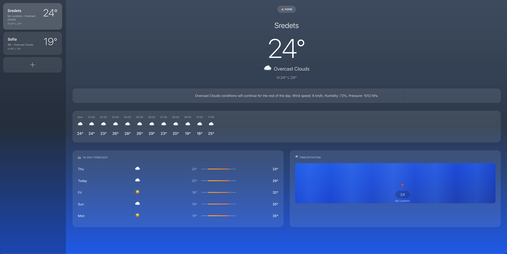
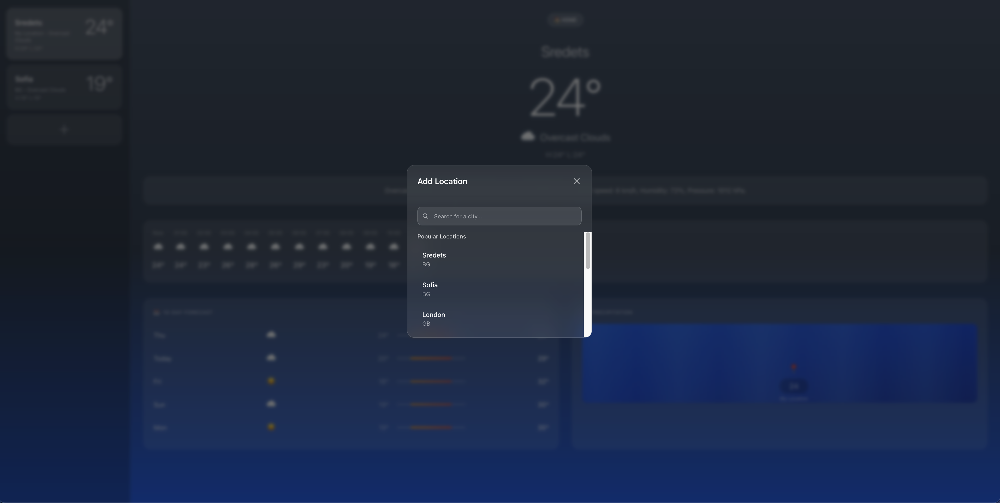

# Live Weather Dashboard

A modern, real-time weather dashboard featuring interactive data visualizations and intelligent weather insights. Built to showcase full-stack development skills with modern web technologies and creative UI design.

## 📸 Live Demo

<div align="center">
  
### 🌤️ Main Dashboard


*Real-time weather data with stunning glassmorphism design, animated charts, and intelligent weather insights*

### 📍 Location Search


*Intuitive location search with popular cities and real-time suggestions*

</div>

---

## 🌟 Features

- **Real-time Weather Data**: Live weather information with automatic updates
- **Interactive Charts**: Dynamic data visualization using Chart.js with animated transitions
- **Weather Insights**: Intelligent analysis cards with floating animations and creative layouts
- **Responsive Design**: Modern glassmorphism UI with stunning gradients and creative effects
- **Real-time Updates**: Live data streaming for up-to-date weather information

## 🛠️ Tech Stack

**Frontend:**
- React 18 with TypeScript
- Vite for fast development and building
- Tailwind CSS for utility-first styling
- Chart.js & React-Chart.js-2 for data visualization
- Creative CSS with glassmorphism effects, animations, and modern gradients
- Responsive design with floating animations and hover effects

**Backend:**
- Node.js with Express
- RESTful API architecture  
- Environment-based configuration
- CORS enabled for cross-origin requests

## 🚀 Setup Instructions

### Prerequisites
- Node.js (v18 or higher)
- npm or yarn package manager
- OpenWeatherMap API key (for real weather data)

### Installation

1. **Clone the repository:**
   ```bash
   git clone https://github.com/BRMilev22/live-weather-dashboard.git
   cd live-weather-dashboard
   ```

2. **Install backend dependencies:**
   ```bash
   cd backend
   npm install
   ```

3. **Install frontend dependencies:**
   ```bash
   cd ../frontend
   npm install
   ```

4. **Environment Setup:**
   - Create `.env` file in the backend directory
   - Add your API key and configuration:
     ```
     PORT=5001
     OPENWEATHER_API_KEY=your_openweathermap_api_key
     NODE_ENV=development
     ```

5. **Start the development servers:**
   
   **Backend (Terminal 1):**
   ```bash
   cd backend
   npm run dev
   ```
   
   **Frontend (Terminal 2):**
   ```bash
   cd frontend
   npm run dev
   ```

6. **Access the application:**
   - Frontend: http://localhost:3000
   - Backend API: http://localhost:5001

## 📁 Project Structure

```
live-weather-dashboard/
├── frontend/              # React TypeScript frontend
│   ├── src/
│   │   ├── components/    # React components
│   │   ├── services/      # API services
│   │   └── types/         # TypeScript type definitions
│   ├── package.json
│   └── vite.config.ts
├── backend/               # Node.js Express backend
│   ├── src/
│   │   ├── routes/        # API routes
│   │   ├── services/      # Business logic
│   │   └── utils/         # Utility functions
│   └── package.json
└── README.md
```

## 🎯 Next Development Steps

### Phase 1: Core Functionality
- [x] **Frontend Integration**
  - ✅ Implement API service layer for weather data fetching
  - ✅ Connect WeatherChart component with Chart.js for real data visualization
  - ✅ Add real-time data updates with 5-minute auto-refresh
  - ✅ Create stunning glassmorphism UI with animations
  - ✅ Add CurrentWeather component with live metrics
  - ✅ Implement loading states and error handling

### Phase 2: Enhanced Features
- [x] **Backend Enhancements**
  - ✅ Replace mock data with real weather API integration (OpenWeatherMap)
  - ✅ Add location-based weather data (geolocation support)
  - ✅ Implement intelligent location search with autocomplete
  - ✅ Add beautiful 5-day weather forecast cards with animations
  - ✅ Implement advanced data caching and rate limiting system
  - ✅ Add smart weather alerts and notifications system
  - ✅ Create creative weather insights section with floating animations
  - ✅ Replace non-functional map with intelligent weather analysis cards

### Phase 3: Advanced UI/UX
- [x] **Creative Design & Interactions**
  - ✅ Install and configure Tailwind CSS for utility-first styling
  - ✅ Create dynamic location management with saved locations
  - ✅ Add functional location search modal with popular cities
  - ✅ Implement stunning creative design with unique visual elements
  - ✅ Add floating animations, hover effects, and creative gradients
  - ✅ Create modern glassmorphism design that stands out
  - ✅ Implement responsive design with advanced CSS animations
  - ✅ Add creative scrollbar styling and background animations

## 🚀 Current Status
✅ Project scaffolding complete  
✅ Frontend and backend structure established  
✅ Phase 1: Core functionality with stunning UI
✅ Phase 2: Enhanced features with real APIs
✅ Phase 3: Advanced UI/UX
✅ Real-time charts and live weather data with OpenWeatherMap API  
✅ Location search, geolocation, and weather forecasts  
✅ Advanced caching, rate limiting, and smart alerts  
✅ Creative weather insights with floating animations  

---

**Developer:** Boris Milev  
**GitHub:** [https://github.com/BRMilev22](https://github.com/BRMilev22)  
**Portfolio Project:** Full-stack weather dashboard showcasing modern web development practices
